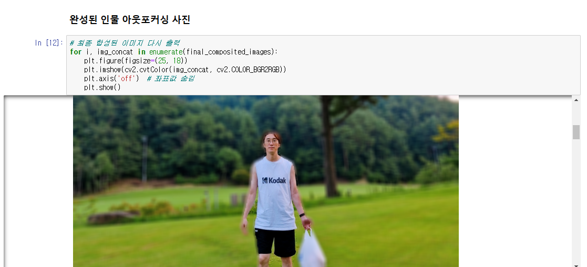
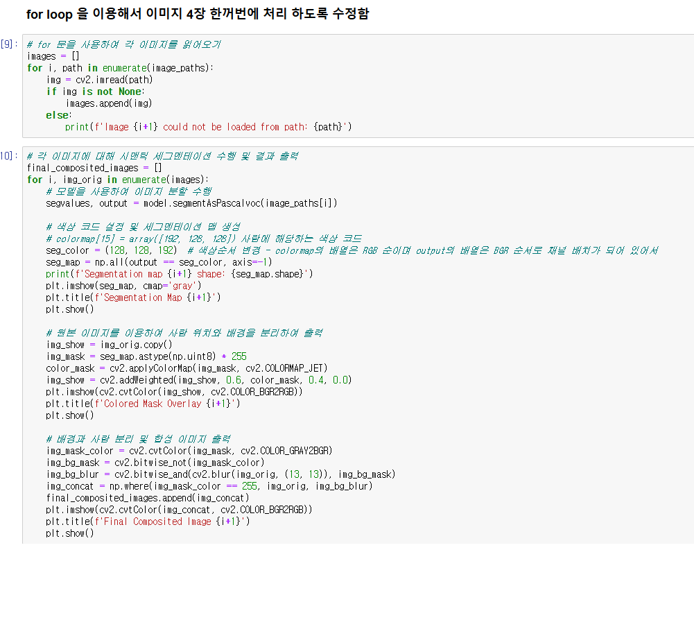
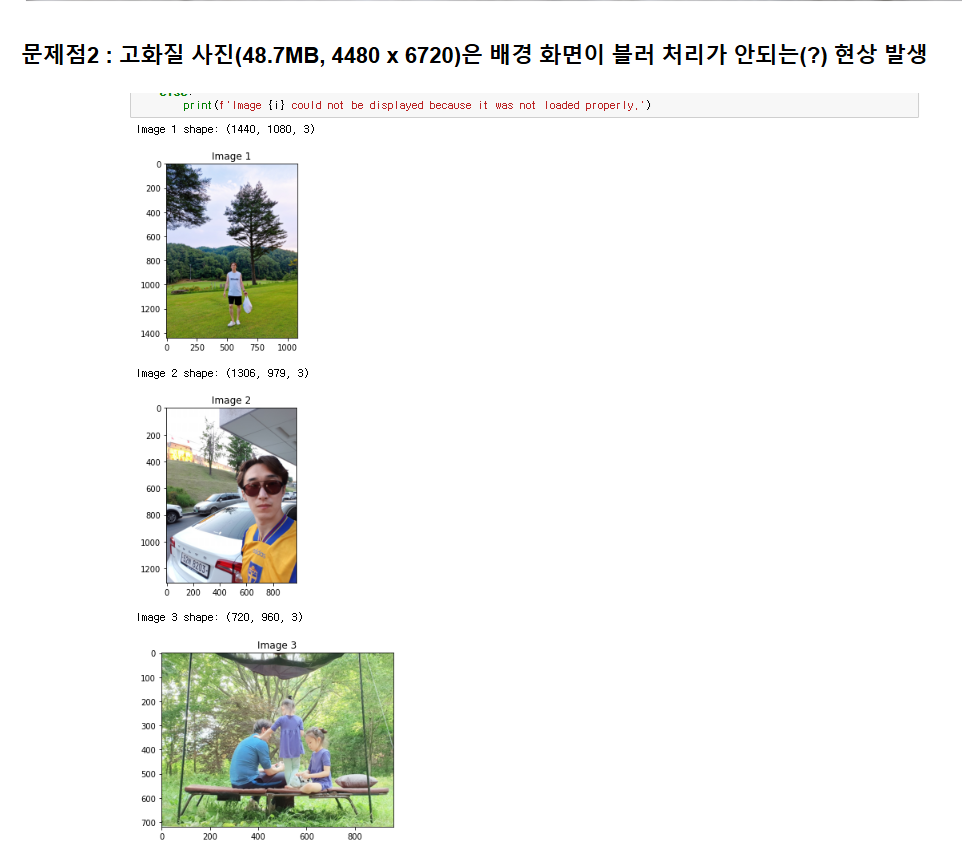
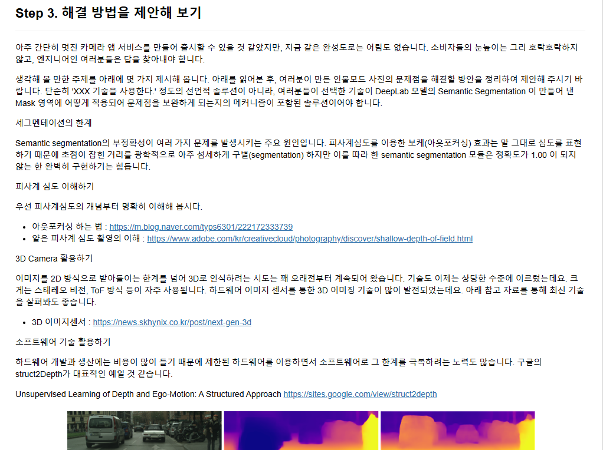
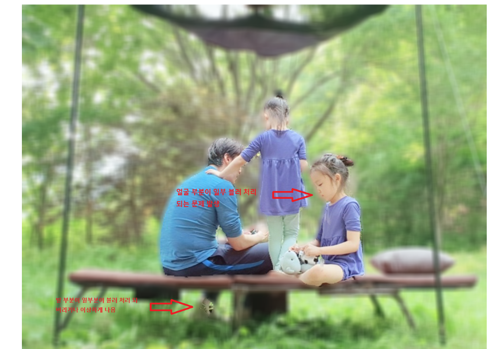
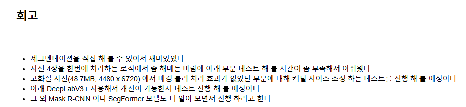
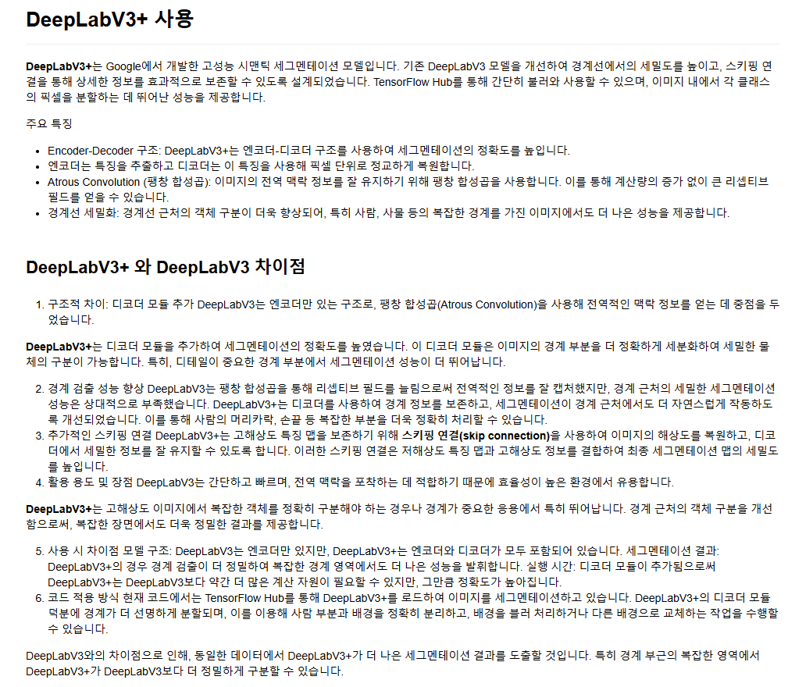
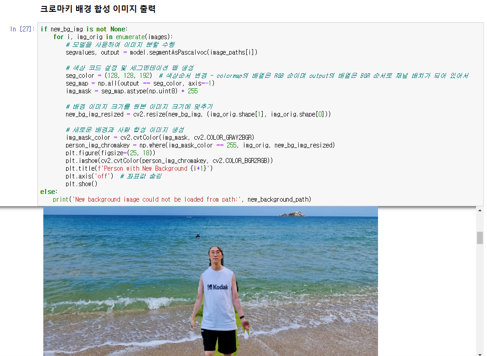
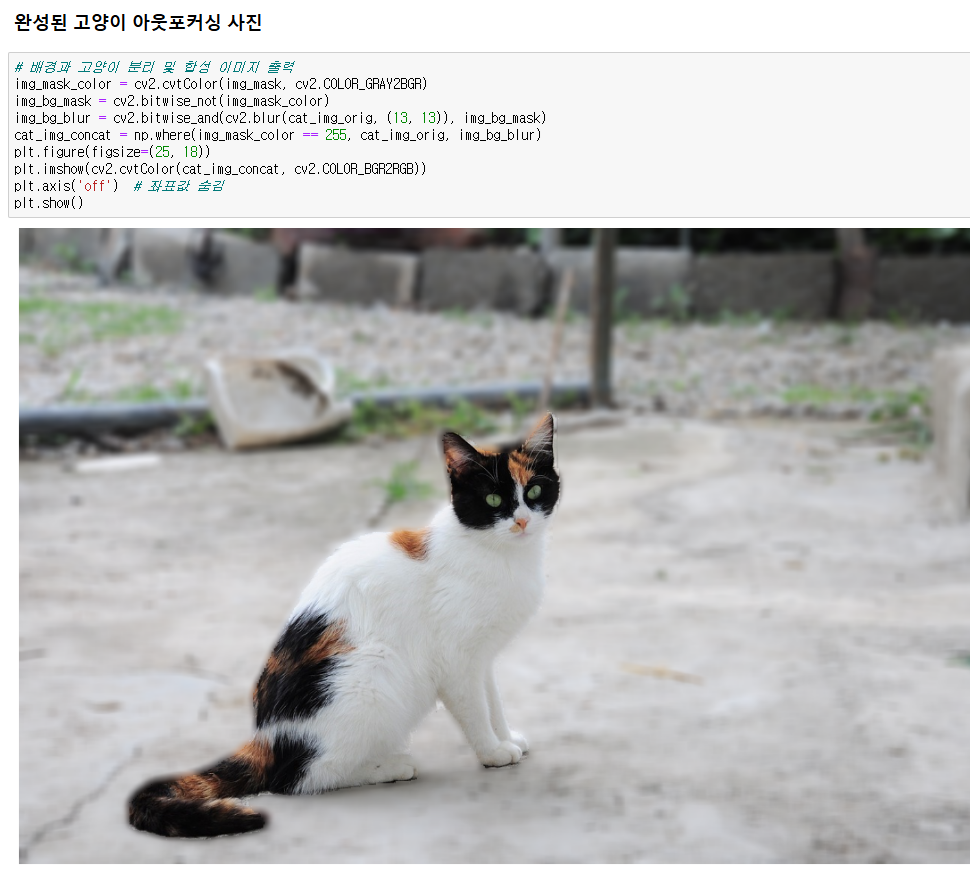

# AIFFEL Campus Online Code Peer Review Templete
- 코더 : 황동주
  - 참고 : 고화질 이미지가 첨부 되어 노트북 파일 사이즈가 큰 관계로 github.dev 로 열거나 pull 해서 로컬에서 열어야 합니다.
    
- 리뷰어 : 김영민


# PRT(Peer Review Template)
- [x]  **1. 주어진 문제를 해결하는 완성된 코드가 제출되었나요?**
    - 문제에서 요구하는 최종 결과물이 첨부되었는지 확인
        - 중요! 해당 조건을 만족하는 부분을 캡쳐해 근거로 첨부
        
        - 서로 다른 구도의 서로 다른 인물이 찍힌 사진 4개를 사용해 결과를 이해하기 쉽게 결과물이 완성되어 있습니다.
    
- [x]  **2. 전체 코드에서 가장 핵심적이거나 가장 복잡하고 이해하기 어려운 부분에 작성된 
주석 또는 doc string을 보고 해당 코드가 잘 이해되었나요?**
    - 해당 코드 블럭을 왜 핵심적이라고 생각하는지 확인
    - 해당 코드 블럭에 doc string/annotation이 달려 있는지 확인
    - 해당 코드의 기능, 존재 이유, 작동 원리 등을 기술했는지 확인
    - 주석을 보고 코드 이해가 잘 되었는지 확인
        - 중요! 잘 작성되었다고 생각되는 부분을 캡쳐해 근거로 첨부
        
        - 전체적으로 주석이 깔끔하고 꼼꼼하게 기록되어 있었으며 사진에서 처럼 사진을 for문을 통해 4장을 처리하는 부분도 주석이 깔끔하게 적혀저 있어서 이해하기 쉬웠습니다.
        - 플롯을 자유자재로 사용하여 여러개의 사진을 처리하면서 동시에 결과를 지켜보기 좋았습니다.
        - 변수명이 깔끔하여 코드 가독성이 좋았습니다. 또 흐름을 이해하기에도 좋았습니다.
```
# for 문을 사용하여 각 이미지를 읽어오기
images = []
for i, path in enumerate(image_paths):
    img = cv2.imread(path)
    if img is not None:
        images.append(img)
    else:
        print(f'Image {i+1} could not be loaded from path: {path}')
        
# 각 이미지에 대해 시맨틱 세그멘테이션 수행 및 결과 출력
final_composited_images = []
for i, img_orig in enumerate(images):
    # 모델을 사용하여 이미지 분할 수행
    segvalues, output = model.segmentAsPascalvoc(image_paths[i])

    # 색상 코드 설정 및 세그멘테이션 맵 생성
    # colormap[15] = array([192, 128, 128]) 사람에 해당하는 색상 코드
    seg_color = (128, 128, 192)  # 색상순서 변경 - colormap의 배열은 RGB 순이며 output의 배열은 BGR 순서로 채널 배치가 되어 있어서
    seg_map = np.all(output == seg_color, axis=-1)
    print(f'Segmentation map {i+1} shape: {seg_map.shape}')
    plt.imshow(seg_map, cmap='gray')
    plt.title(f'Segmentation Map {i+1}')
    plt.show()

    # 원본 이미지를 이용하여 사람 위치와 배경을 분리하여 출력
    img_show = img_orig.copy()
    img_mask = seg_map.astype(np.uint8) * 255
    color_mask = cv2.applyColorMap(img_mask, cv2.COLORMAP_JET)
    img_show = cv2.addWeighted(img_show, 0.6, color_mask, 0.4, 0.0)
    plt.imshow(cv2.cvtColor(img_show, cv2.COLOR_BGR2RGB))
    plt.title(f'Colored Mask Overlay {i+1}')
    plt.show()

    # 배경과 사람 분리 및 합성 이미지 출력
    img_mask_color = cv2.cvtColor(img_mask, cv2.COLOR_GRAY2BGR)
    img_bg_mask = cv2.bitwise_not(img_mask_color)
    img_bg_blur = cv2.bitwise_and(cv2.blur(img_orig, (13, 13)), img_bg_mask)
    img_concat = np.where(img_mask_color == 255, img_orig, img_bg_blur)
    final_composited_images.append(img_concat)
    plt.imshow(cv2.cvtColor(img_concat, cv2.COLOR_BGR2RGB))
    plt.title(f'Final Composited Image {i+1}')
    plt.show()
```
        
- [x]  **3. 에러가 난 부분을 디버깅하여 문제를 해결한 기록을 남겼거나
새로운 시도 또는 추가 실험을 수행해봤나요?**
    - 문제 원인 및 해결 과정을 잘 기록하였는지 확인
    - 프로젝트 평가 기준에 더해 추가적으로 수행한 나만의 시도, 
    실험이 기록되어 있는지 확인
        - 중요! 잘 작성되었다고 생각되는 부분을 캡쳐해 근거로 첨부
        
        
        
        - 문제점을 상세하게 분석했고 이미지에 화살표를 통해 어느 부분에서 문제가 발생했는지 상세히 기록되어 있습니다.
        - 이미지의 크기에 따라 필터의 적용비율이 달라진다는 문제를 통해 회고에 필터 크기를 조절하는 방안을 기록하였습니다.
        
- [x]  **4. 회고를 잘 작성했나요?**
    - 주어진 문제를 해결하는 완성된 코드 내지 프로젝트 결과물에 대해
    배운점과 아쉬운점, 느낀점 등이 기록되어 있는지 확인
    - 전체 코드 실행 플로우를 그래프로 그려서 이해를 돕고 있는지 확인
        - 중요! 잘 작성되었다고 생각되는 부분을 캡쳐해 근거로 첨부
        
        
        - 회고를 통해 앞으로 진행할 추가 실험과 느꼈던점 등이 잘 기록되어 있습니다.
        - 회고 주변에 추가로 알아본 내용에 대해 상세히 기록하여 다음 실험에 도움이 되도록 하였습니다.
        
- [x]  **5. 코드가 간결하고 효율적인가요?**
    - 파이썬 스타일 가이드 (PEP8) 를 준수하였는지 확인
    - 코드 중복을 최소화하고 범용적으로 사용할 수 있도록 함수화/모듈화했는지 확인
        - 중요! 잘 작성되었다고 생각되는 부분을 캡쳐해 근거로 첨부
        
        
        - 주석에 대한 부분도 그렇고 전체적으로 변수명, 함수명이 깔끔해서 가독성이 좋았습니다.
        - 반복문을 사용해 사진 여러개를 동시에 처리한 부분도 효율적이었습니다.
        


# 회고(참고 링크 및 코드 개선)
```
# 리뷰어의 회고를 작성합니다.
# 코드 리뷰 시 참고한 링크가 있다면 링크와 간략한 설명을 첨부합니다.
# 코드 리뷰를 통해 개선한 코드가 있다면 코드와 간략한 설명을 첨부합니다.
```
- 사진을 하나만 사용해서 진행했었는데 동주님의 코드를 참고해서 여러 구도와 여러 색감의 사진들을 사용해 봐야할것 같습니다.
- 동주님의 회고 아래의 deeplab도 참고하여 알아보고 적용할 수 있는 부분이 있으면 적용해 보고 싶습니다.
- 이미지에 화살표가 깔끔하게 처저있어서 그림판으로 대충 그린 제 프로젝트에 대해 반성하게 되었습니다.
- 필터 크기와 사진 크기에 따라 블러의 처리가 상대적으로 옅어질 수 있다는 문제에 대해 알게 되었습니다.
